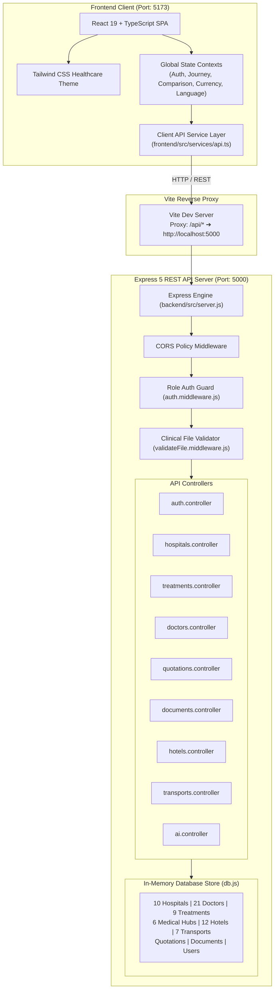
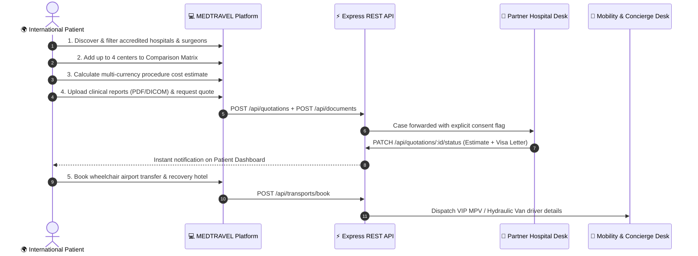

<div align="center">

# 🏥 MEDTRAVEL INDIA
### *From Airport to Recovery — One Platform for Your Medical Journey in India*

[](https://react.dev/)
[](https://www.typescriptlang.org/)
[](https://vitejs.dev/)
[](https://expressjs.com/)
[](https://tailwindcss.com/)
[](https://nodejs.org/)

[](https://github.com/)
[](http://localhost:5000/api/health)
[](http://localhost:5173/api/health)
[](#-verified-seed-data-audit)
[](#-security-privacy--medical-compliance)
[](LICENSE)

<br/>

**A production-grade, enterprise healthcare travel platform connecting international patients from Bangladesh, the GCC, Africa, Central Asia, and Western nations with verified JCI/NABH-accredited surgical centers in India.**

[🚀 Explore Web App](http://localhost:5173) • [🩺 API Health Endpoint](http://localhost:5000/api/health) • [📖 Full REST API Docs](#-rest-api-specification) • [🏗️ Architecture](#%EF%B8%8F-system-architecture)

</div>

---

## 📑 Table of Contents

- [Overview & Value Proposition](#-overview--value-proposition)
- [System Architecture](#%EF%B8%8F-system-architecture)
- [5-Step Patient Journey Pipeline](#-5-step-patient-journey-pipeline)
- [Core Platform Capabilities](#-core-platform-capabilities)
- [Directory Structure (Separated Monorepo)](#-directory-structure)
- [Quick Start & Installation](#-quick-start--installation)
- [Verified Seed Data Audit](#-verified-seed-data-audit)
- [Demo User Personas](#-demo-user-personas)
- [REST API Specification](#-rest-api-specification)
- [Security, Privacy & Medical Compliance](#-security-privacy--medical-compliance)
- [License & Clinical Disclaimer](#-license--clinical-disclaimer)

---

## 💡 Overview & Value Proposition

India has emerged as one of the world's premier destinations for complex medical surgeries—such as living donor kidney/liver transplants, coronary artery bypass grafting (CABG), robotic joint replacements, and pediatric oncology. Patients experience **65% to 85% cost savings** compared to the US, UK, and Singapore, under internationally accredited clinical standards.

However, international medical travelers face significant logistical and clinical hurdles:
- **Discovery Opacity:** Lack of centralized, transparent comparisons of hospital accreditations, surgeon credentials, bed counts, and specialized international desks.
- **Opaque Pricing:** Unclear fee structures, hidden surgeon/ICU surcharges, and fluctuating currency exchange rates.
- **Fragmented Medical Records:** Unsafe sharing of diagnostic DICOMs, cardiac echoes, and lab tests over consumer messaging channels.
- **Complex Visa & Legal Protocols:** THOTA (Transplantation of Human Organs Act) clearance, government e-Medical Visa eligibility, and FRRO registration rules.
- **Post-Arrival Mobility:** Inaccessible airport transfers, lack of hydraulic wheelchair vehicles, and accommodation disconnected from hospital follow-up visits.

**MEDTRAVEL INDIA** provides a single, unified digital operating system that coordinates the entire patient journey from initial discovery to post-discharge recovery.

---

## 🏗️ System Architecture

The application is structured as a decoupled monorepo featuring a standalone **Vite + React 19 + TypeScript SPA** in `frontend/` and an **Express 5 REST API** in `backend/`.



---

## 🗺️ 5-Step Patient Journey Pipeline



---

## 🌟 Core Platform Capabilities

| Capability | Technical Description | User Experience |
|:---|:---|:---|
| **Hospital Discovery Engine** | Real-time parametric filtering by City, Clinical Specialty, Accreditations (JCI, NABH, NABL), Bed Count, and Airport Distance. | Instant visual cards with verified trust badges, cost indicators, and direct doctor rosters. |
| **Side-by-Side Comparison** | Multi-attribute comparison engine with a persistent bottom drawer supporting up to 4 hospitals simultaneously. | Compare ICU capacity, established year, accreditations, international patient lounges, and pricing. |
| **Dynamic Procedure Calculator** | Real-time multi-currency calculator with live conversions for 9 global currencies (USD, EUR, GBP, BDT, AED, OMR, SAR, KWD, INR). | Visual savings benchmark graph comparing India costs with US ($85k vs $5.5k for CABG). |
| **Formal Quotation Pipeline** | Full clinical inquiry submission workflow supporting surgeon selection, companion info, visa assistance, and airport escort. | Inquiry status lifecycle (`SUBMITTED` ➔ `UNDER_REVIEW` ➔ `ESTIMATE_PROVIDED` ➔ `CONFIRMED`). |
| **Secure Document Vault** | Client & server-enforced clinical file validation (.pdf, .dicom, .jpg, .png) with automated blocking of malicious extensions (.exe, .bat, .sh). | Individual patient file consent controls enabling/revoking clinical sharing per document. |
| **Integrated Travel & Mobility** | Pre-arrival logistics engine integrating 12 recovery-friendly hotels and 7 mobility fleet options. | One-click booking for wheelchair hydraulic lift vans and airport arrival VIP MPVs. |
| **MediGuide AI Assistant** | Context-aware healthcare triage assistant providing procedure insights, THOTA donor guidelines, and visa checklists. | Conversational widget with instant routing shortcuts to relevant hospital and cost views. |
| **Role-Based Access Control** | Dedicated user switching across 5 discrete personas: Patient, Hospital Coordinator, Recovery Hotel Desk, Transport Dispatch, Super Admin. | Admin portal with full CRUD for hospitals, treatments, and quotation reviews. |

---

## 📂 Directory Structure

The repository is organized into a clean, separated monorepo architecture:

```text
MEDTRAVEL-INDIA/
│
├── backend/                              # Express 5 REST API Backend (Port: 5000)
│   ├── src/
│   │   ├── config/
│   │   │   └── index.js                  # Environment configs, allowed origins, mime whitelist
│   │   ├── controllers/                  # Business logic & resource handlers
│   │   │   ├── ai.controller.js          # MediGuide conversational triage & guidance
│   │   │   ├── auth.controller.js        # User login, registration & session introspection
│   │   │   ├── doctors.controller.js     # Doctor directory & hospital affiliations
│   │   │   ├── documents.controller.js   # Secure medical record uploads & consent toggles
│   │   │   ├── hospitals.controller.js   # Hospital search, filter & administrative CRUD
│   │   │   ├── hotels.controller.js      # Recovery hotels near medical centers
│   │   │   ├── quotations.controller.js  # Patient inquiries, status flow & consultations
│   │   │   ├── transports.controller.js  # Chauffeur & wheelchair mobility dispatch
│   │   │   └── treatments.controller.js  # Treatment procedures catalog & package management
│   │   ├── data/
│   │   │   ├── db.js                     # In-memory database engine with seed records
│   │   │   └── initialData.json          # Seed dataset (10 Hosp, 21 Docs, 9 Treats, etc.)
│   │   ├── middleware/
│   │   │   ├── auth.middleware.js        # Role-based authorization (requireAdmin, requirePatient)
│   │   │   ├── errorHandler.js           # Centralized HTTP status and stack error handler
│   │   │   └── validateFile.middleware.js# File extension & safety validator (.pdf/.dicom vs .exe)
│   │   ├── routes/                       # Express router definitions
│   │   │   ├── ai.routes.js              # POST /api/ai/chat
│   │   │   ├── auth.routes.js            # POST /api/auth/login, register, me, logout
│   │   │   ├── doctors.routes.js         # GET /api/doctors, /:id
│   │   │   ├── documents.routes.js       # GET /api/documents, POST, DELETE, PATCH consent
│   │   │   ├── hospitals.routes.js       # GET /api/hospitals, POST, PUT, DELETE
│   │   │   ├── hotels.routes.js          # GET /api/hotels, /:id
│   │   │   ├── quotations.routes.js      # GET /api/quotations, POST, PATCH status, appointment
│   │   │   ├── transports.routes.js      # GET /api/transports, /bookings, POST /book
│   │   │   └── treatments.routes.js      # GET /api/treatments, POST, PUT, DELETE
│   │   └── server.js                     # Express app initialization & port listener
│   └── package.json                      # Backend-specific dependencies (express, cors)
│
├── frontend/                             # React 19 + TypeScript + Vite SPA (Port: 5173)
│   ├── public/                           # Static public assets
│   ├── src/
│   │   ├── assets/                       # Brand icons, SVGs & optimized hero photography
│   │   ├── components/                   # Modular UI library
│   │   │   ├── ai/                       # AI MediGuide assistant chat widget
│   │   │   ├── common/                   # Navbar, Footer, ComparisonDrawer, Badges
│   │   │   ├── emergency/                # 24/7 International patient emergency hotline modal
│   │   │   ├── estimator/                # Multi-currency procedure cost calculator widget
│   │   │   ├── hospitals/                # Hospital cards, quotation inquiry modal
│   │   │   └── landing/                  # Hero section, savings comparison, journey pipeline
│   │   ├── context/                      # React Context state management
│   │   │   ├── AuthContext.tsx           # Multi-role authentication & demo personas
│   │   │   ├── ComparisonContext.tsx     # Hospital comparison cart (up to 4 items)
│   │   │   ├── CurrencyContext.tsx       # Live exchange rate calculations (9 currencies)
│   │   │   ├── JourneyContext.tsx        # Quotations, medical records, bookings & catalogs
│   │   │   └── LanguageContext.tsx       # Multi-lingual UI translations (EN, AR, BN, RU, FR)
│   │   ├── data/                         # Verified mock seed catalogs and localized content
│   │   │   ├── mockCities.ts             # 6 Indian medical hub cities
│   │   │   ├── mockDemoUser.ts           # Demo patient Ahmed Hossain (Dhaka)
│   │   │   ├── mockDoctors.ts            # 21 Specialists with qualifications & fees
│   │   │   ├── mockHospitals.ts          # 10 JCI / NABH accredited hospital centers
│   │   │   ├── mockHotels.ts             # 12 Patient-friendly recovery hotels
│   │   │   ├── mockReviews.ts            # Verified international patient reviews
│   │   │   ├── mockTransports.ts         # 7 Airport & wheelchair mobility services
│   │   │   ├── mockTreatments.ts         # 9 Clinical specialty treatment packages
│   │   │   └── mockVisaChecklist.ts      # Indian e-Medical Visa eligibility checklist
│   │   ├── pages/                        # Top-level application route views
│   │   │   ├── AboutPage.tsx             # Mission, values & clinical advisory board
│   │   │   ├── AdminDashboardPage.tsx    # Admin CRUD portal for hospitals, treatments & quotes
│   │   │   ├── CityExplorerPage.tsx      # City guide (Delhi NCR, Chennai, Mumbai, etc.)
│   │   │   ├── ContactPage.tsx           # Help desks, WhatsApp desk & inquiry form
│   │   │   ├── DoctorDetailPage.tsx      # Doctor credentials, specialties, & booking
│   │   │   ├── DoctorsExplorerPage.tsx   # Search doctors by specialty, city, hospital
│   │   │   ├── HospitalDetailPage.tsx    # In-depth hospital profile, virtual tour, doctors
│   │   │   ├── HospitalDiscoveryPage.tsx # Filterable hospital search engine
│   │   │   ├── HotelsExplorerPage.tsx    # Recovery hotels near hospitals
│   │   │   ├── HowItWorksPage.tsx        # Step-by-step medical tourism process guide
│   │   │   ├── LandingPage.tsx           # Homepage with hero, highlights, & trust badges
│   │   │   ├── LoginPage.tsx             # Patient & partner login portal
│   │   │   ├── MedicalDocumentsPage.tsx  # Encrypted health document vault & consent manager
│   │   │   ├── MultiHospitalComparePage.tsx # Side-by-side comparison table
│   │   │   ├── PatientDashboardPage.tsx  # Patient timeline, quotes, bookings, attendants
│   │   │   ├── RegistrationPage.tsx      # Patient onboarding registration form
│   │   │   ├── TransportExplorerPage.tsx # Airport transfer & wheelchair cab booking
│   │   │   ├── TreatmentsCatalogPage.tsx # Treatment procedure browser with cost ranges
│   │   │   └── VisaGuidePage.tsx         # Indian e-Medical Visa portal & FRRO guide
│   │   ├── services/
│   │   │   └── api.ts                    # Typed client service for REST backend integration
│   │   ├── types/
│   │   │   └── index.ts                  # Shared TypeScript models and interfaces
│   │   ├── App.tsx                       # Main router & role-based route guard
│   │   ├── index.css                     # Tailwind CSS directives & custom styles
│   │   └── main.tsx                      # React DOM mount point
│   ├── index.html                        # HTML entry point
│   ├── package.json                      # Frontend dependencies (React 19, Lucide, Tailwind, Vite)
│   ├── postcss.config.js                 # PostCSS configuration
│   ├── tailwind.config.js                # Healthcare color system theme
│   ├── tsconfig.json                     # TypeScript compiler options
│   ├── tsconfig.app.json                 # Frontend application TS configuration
│   ├── tsconfig.node.json                # Tooling TS configuration
│   └── vite.config.ts                    # Vite bundler & reverse proxy configuration
│
├── package.json                          # Workspace root monorepo scripts
├── .gitignore                            # Standard git ignore patterns
└── README.md                             # Platform documentation
```

---

## ⚡ Quick Start & Installation

### 1. Prerequisites
- **Node.js**: v18.0.0 or higher (Verified on Node v24.18.0)
- **npm**: v9.0.0 or higher

### 2. Installation
Clone the repository and install workspace dependencies:
```bash
git clone https://github.com/your-org/medtravel-india.git
cd medtravel-india

# Installs root and workspace packages in one command
npm install
```

### 3. Run Development Environment

Both services can be launched directly from the root workspace:

```bash
# Terminal 1: Launch Express REST API (Port: 5000)
npm run server

# Terminal 2: Launch Vite Frontend Dev Server (Port: 5173)
npm run dev
```

*The Vite dev server automatically proxies any `/api/*` call to `http://localhost:5000`.*

### 4. Direct Subdirectory Commands (Optional)
If you prefer running commands inside the individual folders:

```bash
# Frontend only
cd frontend
npm run dev

# Backend only
cd backend
npm run dev # or npm start
```

### 5. Production Build
```bash
npm run build
# Or explicitly:
npm run build:frontend
```
*Outputs an optimized, minified bundle in `frontend/dist/`.*

---

## 📊 Verified Seed Data Audit

The platform is pre-loaded with comprehensive clinical seed data matching all MVP requirements:

| Domain Catalog | Count | Seed Highlights |
|:---|:---:|:---|
| **Accredited Hospitals** | **10** | Apollo Hospitals (Chennai), MGM Healthcare (Chennai), MIOT International (Chennai), Fortis Memorial Research Institute (Gurgaon), Medanta The Medicity (Gurgaon), Max Super Speciality (Saket, Delhi), Kokilaben Dhirubhai Ambani (Mumbai), Artemis Hospital (Gurgaon), Manipal Hospital (Bangalore), Aster Medcity (Kochi). |
| **Specialist Doctors** | **21** | Dr. Ramesh Sundaram (Senior CTVS Surgeon), Dr. Priya Varma (Director of BMT & Hematology), Dr. Naresh Trehan (Chairman of Cardiac Surgery), Dr. Ashok Rajgopal (Orthopedics & Joint Replacement), Dr. Mohamed Rela (Liver Transplant Specialist). |
| **Clinical Specialties** | **9** | Kidney/Urology, Cardiology, Oncology, Orthopedics, Neurology, Gastroenterology, Cosmetic Surgery, General Surgery, Ophthalmology. |
| **Medical Hub Cities** | **6** | Delhi NCR, Chennai, Mumbai, Bangalore, Hyderabad, Kolkata. |
| **Recovery Hotels** | **12** | Lemon Tree Shimona (Chennai), Courtyard by Marriott (Gurgaon), Vivanta (Bangalore), Novotel Juhu (Mumbai), Hyatt Place (Hyderabad). |
| **Patient Mobility Fleet** | **7** | CareWheels Hydraulic Wheelchair Vans, Innova Crysta VIP Airport Transfers, Advanced Life Support Dedicated Ambulances. |

---

## 👤 Demo User Personas

To test the platform across different roles, use the **Role Switcher** in the top navigation bar or log in with these credentials:

| Role | Name | Associated Entity | Capabilities |
|:---|:---|:---|:---|
| **PATIENT** | Ahmed Hossain (Dhaka) | Bangladesh Medical Traveler | Browse hospitals, calculate costs, manage personal document vault, request quotations, view travel timeline. |
| **HOSPITAL** | Dr. K. Nair | Apollo Hospitals Greams Road | Review submitted patient cases, provide medical cost estimates, upload visa invitation letters. |
| **HOTEL** | Guest Care Desk | Lemon Tree Hotel (Chennai) | Manage patient reservations, view accessible room requests, coordinate hospital shuttle times. |
| **TRANSPORT_PARTNER**| Chauffeur Operations | MedRoute Medical Mobility | Dispatch airport MPVs, assign driver/vehicle number, view wheelchair ramp requirements. |
| **ADMIN** | Super Admin | MEDTRAVEL Platform Admin | Full governance portal: Add/edit/delete hospitals, manage treatment pricing packages, audit quotations. |

---

## 🔌 REST API Specification

The Express backend exposes idempotent REST endpoints configured with JSON payload processing and CORS support:

### 1. Health & Platform Status
```http
GET /api/health
```
**Response (200 OK):**
```json
{
  "status": "healthy",
  "platform": "MEDTRAVEL INDIA API Server",
  "version": "1.0.0",
  "uptimeSeconds": 412,
  "timestamp": "2026-09-27T10:00:00.000Z"
}
```

### 2. Hospitals Directory (`/api/hospitals`)
| Method | Endpoint | Access | Description |
|:---|:---|:---|:---|
| `GET` | `/api/hospitals` | Public | Query filters: `city`, `treatment`, `search`, `accreditedOnly`. |
| `GET` | `/api/hospitals/:id` | Public | Full profile, affiliated doctors roster, and nearby recovery hotels. |
| `POST` | `/api/hospitals` | Admin | Register a new partner medical center. |
| `PUT` | `/api/hospitals/:id` | Admin | Update hospital profile, beds, or international patient services. |
| `DELETE` | `/api/hospitals/:id` | Admin | Remove a medical center from the catalog. |

### 3. Treatments Catalog (`/api/treatments`)
| Method | Endpoint | Access | Description |
|:---|:---|:---|:---|
| `GET` | `/api/treatments` | Public | List procedures with average cost ranges in INR and recovery durations. |
| `GET` | `/api/treatments/:id` | Public | Treatment details with matching accredited hospitals. |
| `POST` | `/api/treatments` | Admin | Add a new clinical procedure package. |
| `PUT` | `/api/treatments/:id` | Admin | Update procedure package specifications. |
| `DELETE`| `/api/treatments/:id`| Admin | Delete procedure package. |

### 4. Doctors Directory (`/api/doctors`)
| Method | Endpoint | Access | Description |
|:---|:---|:---|:---|
| `GET` | `/api/doctors` | Public | Query filters: `hospitalId`, `specialty`, `city`, `search`. |
| `GET` | `/api/doctors/:id` | Public | Doctor credentials, hospital affiliation, experience, and consultation fees. |

### 5. Quotation Requests & Consultations (`/api/quotations`)
| Method | Endpoint | Access | Description |
|:---|:---|:---|:---|
| `GET` | `/api/quotations` | Patient/Admin | List patient quotation requests (scoped to logged-in patient). |
| `GET` | `/api/quotations/:id` | Patient/Admin | Retrieve specific case inquiry and hospital estimate. |
| `POST` | `/api/quotations` | Patient | Submit treatment inquiry, notes, and preferences. |
| `PATCH`| `/api/quotations/:id/status` | Hospital/Admin | Transition status (`UNDER_REVIEW`, `ESTIMATE_PROVIDED`, `CONFIRMED`). |
| `POST` | `/api/quotations/:id/appointment` | Patient/Hospital| Schedule a tele-consultation video appointment. |

### 6. Medical Document Vault (`/api/documents`)
| Method | Endpoint | Access | Description |
|:---|:---|:---|:---|
| `GET` | `/api/documents` | Patient/Admin | List patient clinical records (PDF, DICOM, Lab Reports). |
| `POST` | `/api/documents` | Patient | Upload report. Enforces clinical MIME-type validation. |
| `DELETE`| `/api/documents/:id` | Patient | Delete document from vault. |
| `PATCH`| `/api/documents/:id/consent` | Patient | Toggle hospital sharing consent flag. |

#### File Safety Validation Example:
```bash
# Uploading an executable (.exe) is blocked with 400 Bad Request:
curl -X POST http://localhost:5000/api/documents \
  -H "Content-Type: application/json" \
  -d '{"title": "Malicious payload", "fileName": "report.exe"}'
```
**Response:**
```json
{
  "success": false,
  "error": "Security Policy Violation: Uploads with extension \".exe\" are blocked for patient and server safety."
}
```

### 7. Recovery Accommodation & Mobility (`/api/hotels`, `/api/transports`)
| Method | Endpoint | Access | Description |
|:---|:---|:---|:---|
| `GET` | `/api/hotels` | Public | Filters: `city`, `hospitalId`, `wheelchairOnly`. |
| `GET` | `/api/transports` | Public | Filters: `category`, `wheelchairOnly`. |
| `POST` | `/api/transports/book` | Patient | Book airport chauffeur or wheelchair ramp vehicle. |

### 8. MediGuide AI Care Assistant (`/api/ai`)
| Method | Endpoint | Access | Description |
|:---|:---|:---|:---|
| `POST` | `/api/ai/chat` | Public | Healthcare navigation, cost queries, and visa guidance. |

---

## 🛡️ Security, Privacy & Medical Compliance

MEDTRAVEL INDIA adheres to international digital healthcare security principles:

1. **DISHA & HIPAA Principles:**
   - Patient health information is partitioned strictly by authenticated `patientId`.
   - Access to clinical documents by hospital teams requires explicit patient opt-in consent (`isSharedWithHospitalConsent`).
2. **Clinical File Upload Guard:**
   - Both client and server reject dangerous file formats (`.exe`, `.bat`, `.cmd`, `.sh`, `.msi`, `.vbs`, `.scr`).
   - Allowed file formats are restricted to clinical standards: `.pdf`, `.dicom`, `.dcm`, `.jpg`, `.jpeg`, `.png`.
3. **Role-Based Authorization (RBAC):**
   - Routes check user identity and role claims (`requireAdmin`, `requirePatient`, `requireAuth`).
   - Patients cannot inspect other patients' dossiers, quotes, or uploaded medical files.
4. **THOTA Regulatory Compliance:**
   - Clear guidance for living donor organ transplants in compliance with India's Transplantation of Human Organs and Tissues Act (THOTA).

---

## ⚖️ License & Clinical Disclaimer

- **License:** Open-source software under the [MIT License](LICENSE).
- **Clinical Disclaimer:** MEDTRAVEL INDIA is an administrative, informational, and logistical facilitation platform. It connects international patients with accredited Indian healthcare providers. It does **not** provide independent medical diagnoses, clinical prescriptions, or formal medical advice. Patients must consult licensed healthcare professionals for diagnosis and treatment decisions.
